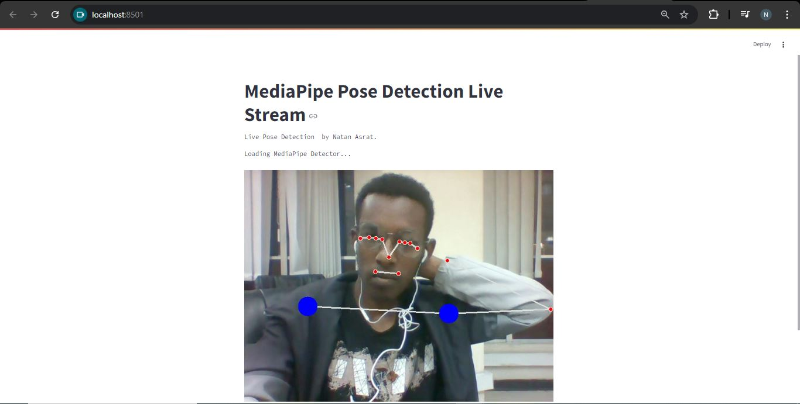

# MediaPipe Pose Estimation
- In this project i implemented a simple pose estimation module that can be used in other projects as well for getting pose landmark positions and drawing them using opencv.

# Setup
- Create virtual environment:  `python -m venv venv`
- Activate virtual environment: `call venv/Scripts/activate.bat` in cmd
- Install dependencies: `pip install -r requirements.txt`
- Run on streamlit: `streamlit run app.py`

# Libraries
- mediapipe
- cvzone
- opencv
- ipykernel
- streamlit-webrtc

## Contact
 - LinkedIn: [Natan Asrat](https://linkedin.com/in/natan-asrat)
 - Gmail: nathanyilmaasrat@gmail.com
 - Telegram: [Natan Asrat](https://t.me/fail_your_way_to_success)
 - Youtube: [Natville](https://www.youtube.com/@natvilletutor)